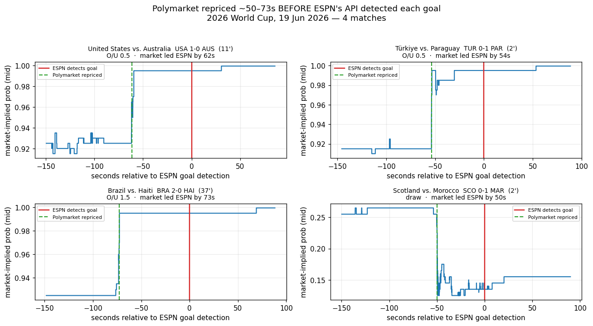

# Polymarket Market-Data Platform

[](https://github.com/SobhiSandakli/Polymarket/actions/workflows/ci.yml)

**Capture any Polymarket market at HFT speed, on a clock shared with a reference feed, then test strategies on it.** A low-latency C++20 tick-data pipeline + a fill-and-fee-accurate Python research harness. Clone it, point it at the markets you care about, and you have clean, millisecond-stamped order-book data and a backtest you can throw any strategy at.

To prove it works — and to find out *how efficient prediction markets really are* — it's been used to run a body of studies: latency against reference feeds (Coinbase BTC, ESPN sports) and several microstructure strategies. The honest result is at the bottom; here's one study's output:



*Polymarket's market-implied probability around four World Cup goals (19 Jun 2026). Red = when ESPN's API detected each goal; green = when Polymarket had already repriced — ~50–73s earlier. The market is faster than the public feed. Reproducible from a fresh clone: [`research/scripts/worldcup_lag_analysis.py`](research/scripts/worldcup_lag_analysis.py).*

---

## What's in the box

| Layer | What it does |
|---|---|
| **Capture (C++20)** | WebSocket → simdjson → lock-free MPSC ring → binary journal. ~2–6μs hot path, no allocation, no locks. Market-generic: point a filter at crypto, sports, politics — anything on Polymarket's CLOB. |
| **Reference feeds** | Coinbase BTC-USD harvester + sport-generic ESPN score collector, run on the **same host and clock** so any feed joins the Polymarket ticks on `ts_ms`. |
| **Research harness (Python)** | DuckDB + Parquet. A fill-simulated backtest engine with Polymarket's full dynamic fee model, a parameter-sweep optimizer, and a locked-parameter out-of-sample validator. Drop in a strategy, get an honest P&L. |
| **Execution (C++20)** | Full bot path: FeedHandler → BookState → StrategyEngine → OrderGateway, Kelly sizing, paper + live modes. |
| **Studies** | Worked examples done on the platform — latency and microstructure — each documented with the data behind the verdict: [`docs/FINDINGS.md`](docs/FINDINGS.md). |

---

## Quick start — capture data

**Requirements:** GCC 12+ or Clang 15+, CMake 3.20+, OpenSSL. Or just Docker. No API keys — Polymarket is a public CLOB.

```bash
# Build
cmake -B build -DCMAKE_BUILD_TYPE=Release
cmake --build build --target polymarket_harvester -j$(nproc)

# Capture live ticks for any markets matching a filter (comma-separated OR)
POLYMARKET_MARKET_FILTER="Bitcoin Up or Down" ./build/src/harvester/polymarket_harvester

# What you'll see:
#   [market-discovery] paging the Gamma API (top ~4,200 active tokens by volume)
#   [market-discovery] filter 'Bitcoin Up or Down' → 10/4200 tokens
#   [ws open] connected to wss://ws-subscriptions-clob.polymarket.com/ws/market
#   Ticks write to data/polymarket_YYYYMMDD_HHMM.bin (15-min rotation)

# Ctrl-C, then decode the binary journal to Parquet:
python3 scripts/harvester/log_to_parquet.py data/polymarket_*.bin
```

Use a **focused filter** — it's the practical mode. Subscribing to the entire firehose produces a subscription message large enough that the server drops the connection (see ADR-0003), so you target the markets you actually want. Docker: `POLYMARKET_MARKET_FILTER="Bitcoin Up or Down" docker compose up harvester`.

**Capture knobs (env vars):**

| Env var | Default | Effect |
|---|---|---|
| `POLYMARKET_MARKET_FILTER` | _(unset → firehose, gets dropped)_ | Comma-separated OR substrings; the markets to subscribe to. |
| `POLYMARKET_DATA_DIR` | `./data` | Where journals + `market_metadata.csv` are written. |
| `POLYMARKET_REDISCOVER_MINS` | `15` | How often to re-scan for new/rolled-over markets. |
| `POLYMARKET_RETENTION_DAYS` | _(unset = **unlimited**)_ | **You own your storage.** Set to `7`/`30`/… and the harvester self-prunes `.bin`/`.parquet` and resolved metadata older than N days (≈hourly, in-process — no scripts, no cron). Unset keeps everything (default). For a cloud archive, prefer an **S3 lifecycle rule** to expire shipped `.parquet`. |

Capturing your own campaigns (joint match + BTC sessions, AWS deployment) is documented in [`docs/CAPTURE_RUNBOOK.md`](docs/CAPTURE_RUNBOOK.md), with a one-command orchestrator at [`scripts/capture/run_capture.sh`](scripts/capture/run_capture.sh).

---

## Test your own strategy

The research layer ([`research/backtest/`](research/backtest/)) is a small, honest backtester:

- **DataLoader** — DuckDB over the captured Parquet, with staleness detection.
- **FillModel** — simulates whether your order actually fills, and charges Polymarket's **real dynamic fee** (`fee = C × feeRate × (p·(1−p))^exponent`, up to ~1.5%). This is what separates a real edge from a fee illusion.
- **Engine** — runs a strategy tick-by-tick, marks open positions to market, tracks P&L and drawdown.

Write a strategy as a subclass of [`strategies/base.py`](research/backtest/strategies/base.py), point the loader at your capture, and run. The committed examples (`convergence_no.py`) and notebooks show the full loop, including the locked-parameter OOS harness that tells you whether an edge is real or overfit.

```bash
python3 -m venv .venv && .venv/bin/pip install -r research/requirements.txt
.venv/bin/jupyter lab research/notebooks/
```

---

## Studies done with the platform

Everything below was produced *with* the tooling above — they're worked examples, and a record of what was tried. Full detail and numbers: [`docs/FINDINGS.md`](docs/FINDINGS.md).

**Latency — does the market lag a reference feed?**

| Study | Result | Reproduces from clone? |
|---|---|---|
| **Sports lag** (ESPN → match markets) | Market repriced goals a median **~58s before** ESPN's API reported them (50–73s, 4 World Cup matches) | ✅ `data/samples/sports/` |
| **Crypto lag** (Coinbase BTC → up/down markets) | No exploitable lag at the same-host measurement floor — market prices BTC moves within the same second | sample capture in progress |

**Microstructure — is there a tradeable edge in the book itself?**

| Strategy | Result | What killed it |
|---|---|---|
| **ConvergenceNo** | +$226 in-sample → **−$219 out-of-sample** (locked params) | Overfit to a BTC-downtrend regime; reversed in [`oos_validation.ipynb`](research/notebooks/oos_validation.ipynb). |
| **MeanReversion** | −$1,207 simulated | Taker fees (up to ~2%) exceed the edge. |
| **MarketMaking** | Ask fills 11.75× more than bid | Adverse selection: whoever lifts your offer knows something. |
| **ArbYesNo** | Zero opportunities in 179M ticks | YES+NO complement held tighter than round-trip fees. |

Reproducibility map for each analysis (which run from a clone vs. need your own capture): [`research/notebooks/README.md`](research/notebooks/README.md).

---

## Architecture

```
                      Data Collection (C++)
┌────────────────────────────────────────────────────┐
│  Polymarket WS ───► simdjson ───► Tick (128B)      │
│  (core 1)          zero-copy    ───► MPSC Ring     │
│                                     [65536 slots]  │
│                                     ───► Tickerplant (core 0)
│                                          ───► .bin journal
│                                                    │
│  Coinbase WS ──────► simdjson ───► BtcTick (64B)   │
│                                 ───► BtcJournal ───► .bin
│                                                    │
│  ESPN scoreboard ─► Python collector ───► .csv     │
│  (1s poll)          (same epoch-ms clock)          │
└──────────────────────────┬─────────────────────────┘
                           │ log_to_parquet.py
                           ▼
                   Research (Python + DuckDB)
   backtest · parameter sweep · lag analysis · OOS validation
```

All feeds share one system clock per host, so cross-feed lag is a direct `ts_ms` join in DuckDB.

### Why each design decision was made

| Component | Decision | Reason |
|---|---|---|
| **Message queue** | Lock-free MPSC ring buffer (65k slots) | A mutex between the I/O thread and journal writer adds 500ns–2μs per tick under contention; the ring adds ~20ns and can never stall the I/O thread on a slow disk write. |
| **JSON parsing** | simdjson (SIMD-accelerated) | ~2.5 GB/s vs ~600 MB/s for RapidJSON, zero-copy — parses directly from the network buffer with no intermediate allocation. |
| **Tick record** | 128 bytes (exactly 2 cache lines) | A struct straddling a 64-byte line causes a split-load — two cache misses per read instead of one. |
| **Thread placement** | I/O → core 1, Tickerplant → core 0 | Scheduler migrations invalidate L1/L2 (100–400 cycles + TLB churn); pinning keeps latency consistent. |
| **Storage** | Binary journal, 15-min rotation | Sequential write, no serialization, no locks. Rotation caps crash data-loss at 15 minutes. |
| **Market filter** | `POLYMARKET_MARKET_FILTER` env var | The full firehose is an ~800 KB subscribe message the server drops (close 1006); a focused filter is ~1 KB and prevents OOM on burstable EC2. |

Deep-dive: [`docs/ARCHITECTURE.md`](docs/ARCHITECTURE.md) · Decision records: [`docs/adr/`](docs/adr/)

---

## Project structure

```
src/        harvester/ (Polymarket capture) · coinbase/ (BTC reference) · bot/ (execution)
            gateway/ (WS + Gamma discovery) · tickerplant/ · feedhandler/ · rdb/
include/    core/ (Tick 128B, BtcTick 64B) · memory/RingBuffer.hpp
research/   backtest/ (fill engine + fee model + optimizer) · notebooks/ · scripts/
data/samples/  committed sample datasets — one per market class
scripts/    harvester/ (.bin→Parquet, ops) · collectors/ (ESPN, Betfair) · capture/ (campaigns)
docs/       ARCHITECTURE · FINDINGS · CAPTURE_RUNBOOK · COINBASE_SETUP · adr/
tests/      ring buffer · feedhandler · tickerplant · order book
```

### Build targets

```bash
cmake --build build --target polymarket_harvester   # tick data capture
cmake --build build --target coinbase_harvester     # Coinbase BTC reference feed
cmake --build build --target polymarket_bot         # execution infra (paper + live)
ctest --test-dir build                              # 4 test suites
```

---

## The honest conclusion

The platform was built to attack Polymarket, and it failed to find a tradeable edge — which is itself the finding. At every timescale and information set accessible to a non-colocated participant, the market was efficient: any signal computable from public data was already in the price, and the dynamic fee structure widens the no-arbitrage band beyond every deviation found. The one frontier left untested is the **sub-second regime**, which needs colocation or a faster reference feed — and the infrastructure to run that test is exactly this repo. In the meantime, it's a clean way to pull Polymarket data and test ideas of your own.
