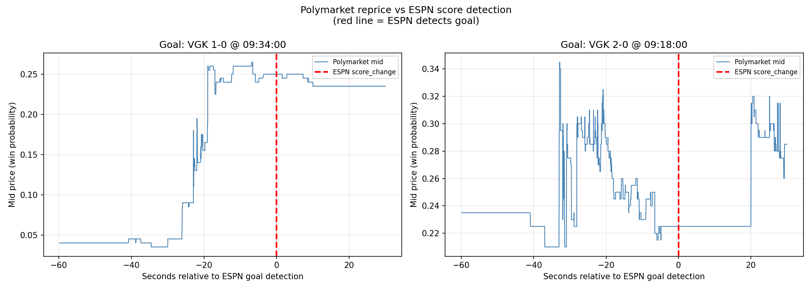

# Polymarket Efficiency Study

[](https://github.com/SobhiSandakli/Polymarket/actions/workflows/ci.yml)

Low-latency C++20 market-data infrastructure and a Python research layer, built to answer one question: **how efficient are prediction markets?**

The hypothesis was that Polymarket reprices slower than the underlying information arrives — across crypto (Coinbase → BTC binary markets) and live sports (score feeds → match markets) — and that the lag is tradable. Six strategies were built and tested against live captured data. **Every one was killed**, including one that looked profitable until an out-of-sample test with locked parameters reversed it. The market priced everything reachable from public data before this pipeline could: in the cleanest measurement, Polymarket fully repriced a Stanley Cup goal **26–33 seconds before ESPN's API detected it**.



*Polymarket mid-price around two goals (2026 Stanley Cup Finals, Game 4). The red line is when ESPN's API detected the goal — the market had already finished repricing. Reproducible from a fresh clone: [`event_lag_analysis.ipynb`](research/notebooks/event_lag_analysis.ipynb).*

---

## What's here

| Layer | What it does |
|---|---|
| **Capture (C++20)** | WebSocket → simdjson → lock-free MPSC ring → binary journal. ~2–6μs hot path, no allocation, no locks. Generic over markets: crypto, sports, anything on Polymarket's CLOB. |
| **Reference feeds** | Coinbase BTC-USD harvester (same-host, same-clock for direct lag joins) + sport-generic ESPN score collector. |
| **Research (Python)** | DuckDB + Parquet. Fill-simulated backtest engine with Polymarket's full dynamic fee model, parameter-sweep optimizer, locked-parameter OOS validation harness. |
| **Execution (C++20)** | Full bot path FeedHandler → BookState → StrategyEngine → OrderGateway with Kelly sizing, paper + live modes. Never deployed live — no strategy survived validation. |
| **Findings** | Six strategies, six verdicts, all documented with the data that killed them: [`docs/FINDINGS.md`](docs/FINDINGS.md). |

---

## Quick start

**Requirements:** GCC 12+ or Clang 15+, CMake 3.20+, OpenSSL. Or just Docker. No API keys — Polymarket is a public CLOB.

```bash
# Build
cmake -B build -DCMAKE_BUILD_TYPE=Release
cmake --build build --target polymarket_harvester -j$(nproc)

# Capture live ticks for any market matching a filter
POLYMARKET_MARKET_FILTER="Bitcoin" ./build/src/harvester/polymarket_harvester

# What you'll see:
#   [market-discovery] Fetching pages 1..50 from Gamma API (~10s)
#   [market-discovery] filter 'Bitcoin' → 18/10000 tokens
#   [ws open] connected to wss://ws-subscriptions-clob.polymarket.com/ws/market
#   Ticks write silently to data/polymarket_YYYYMMDD_HHMM.bin (15-min rotation)

# Ctrl-C, then decode what was captured:
python3 scripts/harvester/log_to_parquet.py data/polymarket_*.bin
```

Or with Docker:

```bash
POLYMARKET_MARKET_FILTER="Bitcoin" docker compose up harvester
```

Run the tests:

```bash
cmake --build build -j$(nproc) && ctest --test-dir build
```

## Reproduce the findings from a clone

Small curated captures are committed under [`data/samples/`](data/samples/) — one per market class — so the analysis notebooks run end-to-end without capturing anything:

```bash
python3 -m venv .venv && .venv/bin/pip install -r research/requirements.txt
.venv/bin/jupyter lab research/notebooks/
```

| Notebook | Dataset | Runs from clone? |
|---|---|---|
| [`event_lag_analysis.ipynb`](research/notebooks/event_lag_analysis.ipynb) — sports lag measurement | `data/samples/sports/` (Stanley Cup G4) | ✅ |
| [`oos_validation.ipynb`](research/notebooks/oos_validation.ipynb) — the locked-parameter test that killed ConvergenceNo | executed outputs committed | results visible on GitHub |
| [`coinbase_lag_analysis.ipynb`](research/notebooks/coinbase_lag_analysis.ipynb) — BTC cross-venue lag | `data/samples/crypto/` (capture in progress) | soon |
| [`run_backtest.ipynb`](research/notebooks/run_backtest.ipynb) / [`run_optimizer.ipynb`](research/notebooks/run_optimizer.ipynb) | full dataset (not committed) | outputs committed |

Capturing your own data — including the AWS crypto campaign and World Cup 2026 matches — is documented in [`docs/CAPTURE_RUNBOOK.md`](docs/CAPTURE_RUNBOOK.md).

---

## Research findings

Six strategies tested against a fill-simulated backtest with Polymarket's full dynamic fee model. All killed. Full detail with the numbers: [`docs/FINDINGS.md`](docs/FINDINGS.md).

| Strategy | Result | What killed it |
|---|---|---|
| **ConvergenceNo** | +$226 in-sample → **-$219 out-of-sample** (locked params) | Overfit to a BTC-downtrend regime. The OOS run that reversed it is committed in [`oos_validation.ipynb`](research/notebooks/oos_validation.ipynb). |
| **MeanReversion** | -$1,207 simulated | Taker fees (up to 2%) exceed the edge mean reversion provides. |
| **MarketMaking** | Ask fills 11.75× more frequent than bid | Adverse selection: in a binary market, whoever lifts your offer knows something. |
| **ArbYesNo** | Zero opportunities in 179M ticks | YES+NO complement enforced tighter than round-trip fees. |
| **Coinbase lag arb** | No exploitable lag at same-host measurement floor | Market prices Coinbase moves within the same second. Colocation-scale untested. |
| **Sports lag arb** | Market leads every accessible feed by 15–30s | Measured live during the Stanley Cup Finals (chart above). |

**The honest conclusion:** at every timescale and information set accessible to a non-colocated participant, Polymarket was efficient — any signal computable from public data was already in the price, and the fee structure widens the no-arbitrage band beyond every deviation found. What remains untested is the sub-second regime, which requires colocation or a faster reference feed. The infrastructure to run that test is this repo.

---

## Architecture

```
                      Data Collection (C++)
┌────────────────────────────────────────────────────┐
│                                                    │
│  Polymarket WS ───► simdjson ───► Tick (128B)      │
│  (core 1)          zero-copy    ───► MPSC Ring     │
│                                     [65536 slots]  │
│                                     ───► Tickerplant (core 0)
│                                          ───► .bin journal
│                                                    │
│  Coinbase WS ──────► simdjson ───► BtcTick (64B)    │
│  (core 2)                       ───► BtcJournal    │
│                                      ───► .bin journal
│                                                    │
│  ESPN scoreboard ─► Python collector ───► .csv     │
│  (1s poll)          (same epoch-ms clock)          │
└──────────────────────────┬─────────────────────────┘
                           │ log_to_parquet.py
                           ▼
                       Parquet files
                           │
                           ▼
                   Research (Python + DuckDB)
┌──────────────────────────────────────────────────────┐
│  Notebooks: backtest · parameter sweep · lag analysis │
│  Backtest engine: full-fee fill simulation            │
│  Strategies tested: 6 — all killed (see Findings)     │
└──────────────────────────────────────────────────────┘
```

All feeds share one system clock per host, so cross-feed lag is a direct `ts_ms` join in DuckDB.

### Why each design decision was made

| Component | Decision | Reason |
|---|---|---|
| **Message queue** | Lock-free MPSC ring buffer (65k slots) | A mutex between the I/O thread and journal writer adds 500ns–2μs per tick under contention; the ring buffer adds ~20ns. The Tickerplant can never stall the I/O thread on a slow disk write. |
| **JSON parsing** | simdjson (SIMD-accelerated) | ~2.5 GB/s vs ~600 MB/s for RapidJSON, and zero-copy — parses directly from the network buffer with no intermediate string allocation. |
| **Tick record** | 128 bytes (exactly 2 cache lines) | A struct straddling a 64-byte cache line causes a split-load — two cache misses per read instead of one. |
| **Thread placement** | Core affinity: I/O → core 1, Tickerplant → core 0 | Scheduler migrations invalidate L1/L2 — 100–400 cycle penalty plus TLB churn. Pinning makes latency measurements consistent across runs. |
| **Storage** | Binary journal, 15-min rotation | Sequential write, no serialization, no locks. Rotation caps crash data-loss at 15 minutes. |
| **Market filter** | `POLYMARKET_MARKET_FILTER` env var | Subscribing to all ~10,000 tokens produces an ~800 KB subscription message the server drops (close 1006); a focused filter is ~1 KB. Also prevents OOM on burstable EC2. |

Deep-dive: [`docs/ARCHITECTURE.md`](docs/ARCHITECTURE.md) · Decision records: [`docs/adr/`](docs/adr/)

---

## Project structure

```
polymarket/
├── src/
│   ├── harvester/          # Polymarket tick capture (market-generic via filter)
│   ├── coinbase/            # Coinbase BTC-USD reference feed (same-clock lag joins)
│   ├── bot/                # Execution path: FeedHandler → StrategyEngine → OrderGateway
│   ├── gateway/            # WebSocket client + Gamma API market discovery
│   ├── tickerplant/        # Journal writer (consumer side of MPSC ring)
│   ├── feedhandler/        # simdjson tick parser
│   └── rdb/                # In-memory order book
│
├── include/polymarket/
│   ├── core/               # Tick (128B) + BtcTick (64B) records
│   └── memory/RingBuffer.hpp
│
├── research/
│   ├── backtest/           # Fill-simulated engine, dynamic fee model, optimizer
│   ├── notebooks/          # Strategy analyses + lag studies (see notebooks/README.md)
│   └── requirements.txt
│
├── data/samples/           # Committed sample datasets — one per market class
│
├── scripts/
│   ├── harvester/          # Binary journal → Parquet decoders, ops scripts
│   └── collectors/         # ESPN (sport-generic) + Betfair event collectors
│
├── docs/
│   ├── ARCHITECTURE.md     # System design deep-dive
│   ├── FINDINGS.md         # Every strategy: thesis, data, verdict
│   ├── CAPTURE_RUNBOOK.md  # How to run capture campaigns (AWS crypto, World Cup)
│   └── adr/                # Architecture decision records
│
├── tests/                  # Ring buffer, feedhandler, tickerplant, order book
├── Dockerfile / docker-compose.yml   # harvester + event collector services
└── CMakeLists.txt
```

## Build targets

```bash
cmake --build build --target polymarket_harvester   # tick data capture
cmake --build build --target coinbase_harvester      # Coinbase BTC reference feed
cmake --build build --target polymarket_bot         # execution infra (paper + live)
ctest --test-dir build                               # 4 test suites
```
